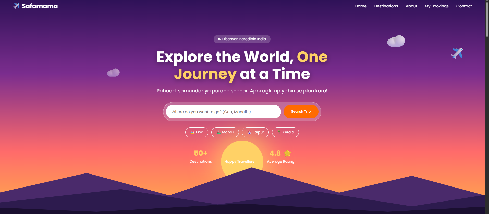
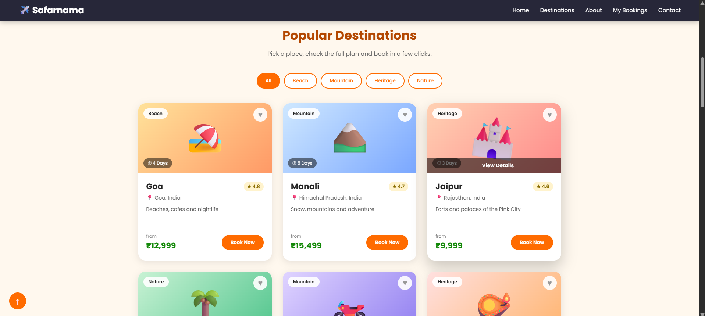
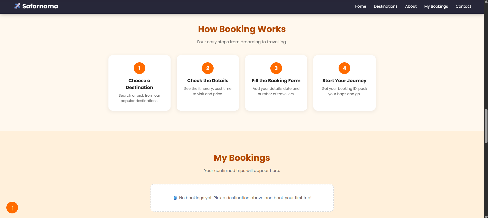
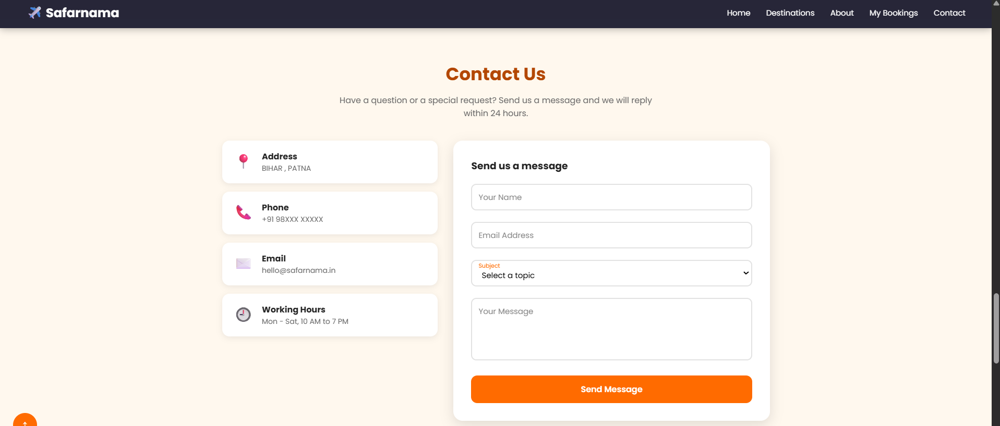

# ✈️ Safarnama — Discover Your Next Journey

> Your next adventure begins here. Explore the world, one destination at a time. 🌍

Safarnama is a travel website created using **HTML, CSS, and JavaScript**. It features a travel-inspired design that helps users explore destinations through an engaging and user-friendly interface.

🔗 **Live Website:** [Explore Safarnama](https://aasthaverma00.github.io/safarnama-travel-website/)

---

## ✨ Features

- 🌍 Attractive travel-themed homepage
- 🗺️ Explore popular travel destinations
- 🖼️ Beautiful destination imagery
- 🎨 Smooth animations and interactive hover effects
- 📱 Responsive and user-friendly layout
- 🧭 Booking and contact sections
- ⚡ Interactive elements powered by JavaScript

## 🛠️ Built With

- **HTML5** — Structure
- **CSS3** — Styling and animations
- **JavaScript** — Interactivity

---


## 📸 Website Preview

### 🏠 Home Page


### 🌎 Destinations


### 🧳 Booking Section


### 📩 Contact Section



---


## 📂 Project Structure

```text
safarnama-travel-website/
├── images/
│   ├── home.png
│   ├── destinations.png
│   ├── booking.png
│   └── contact.png
├── index.html
├── style.css
├── script.js
└── README.md
```

## 🚀 Run Locally

1. Clone this repository.
2. Open the project folder in VS Code.
3. Open `index.html` in your browser.

## 📚 What I Learned

- Structuring webpages with HTML
- Styling layouts and animations using CSS
- Adding interactivity with JavaScript
- Organizing project assets and screenshots
- Deploying a website with GitHub Pages

---

## 👩‍💻 Developer

**Aastha Verma**  
BCA Student | Web Development Enthusiast

🔗 [GitHub Profile](https://github.com/aasthaverma00)

---

⭐ If you like this project, consider giving the repository a star!

*Made with ❤️ by Aastha Verma*
